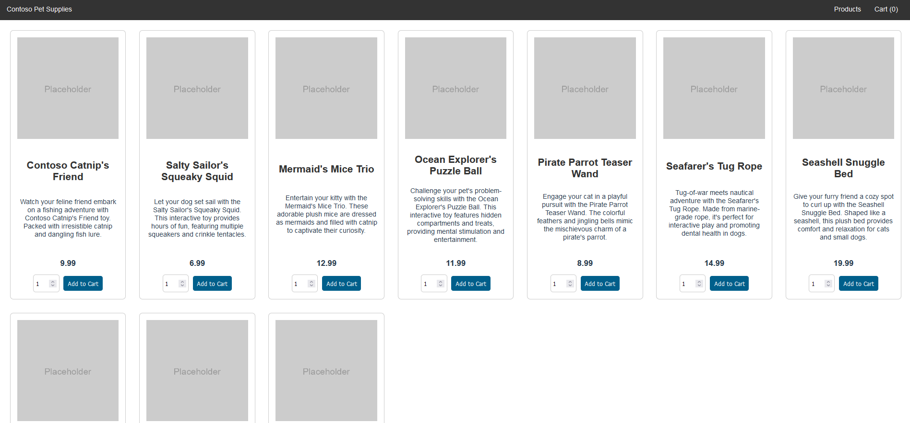

Archi Azure
---


Provisioning Terraform
---
```
terraform init -backend-config="backend.tfvars"

terraform plan -out="myplan.plan" ou terraform plan -var-file="./env/my-var-file.tfvars" -out="myplan.plan"

terraform apply myplan.plan
```

Connexion à Kubernetes
---
```
az account set --subscription subscriptionId

az aks get-credentials --resource-group rgName --name clusterName --overwrite-existing
```

Déploiement d'une sample app
---

From [Github](https://github.com/Azure-Samples/aks-store-demo)

```
kubectl create ns myNamespace

kubectl apply -f ./app/aks-store-quickstart.yaml -n myNamespace
```

Validation fonctionnelle de l'app
---
Aller dans le cluster, dans la partie Services & Ingresses, et cliquer sur l'IP publique



